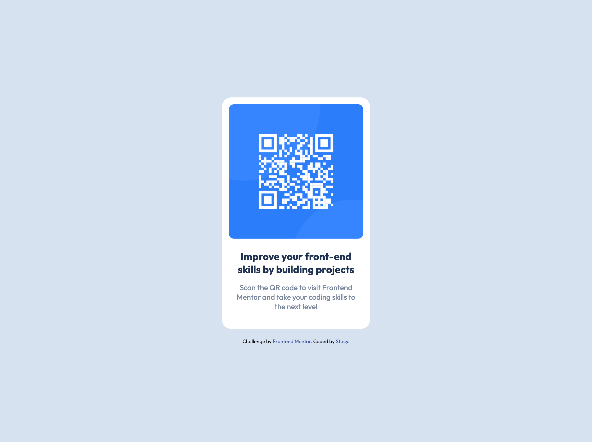

### Screenshot

### Built with

- Semantic HTML5 markup
- CSS custom properties
- Flexbox
- Mobile-first workflow

### What I learned

As a beginner, I learned how to utilize dev tools to apply flexbox correctly in this project.
I am also proud that my project closely adhered to the original design by paying attention to details.
